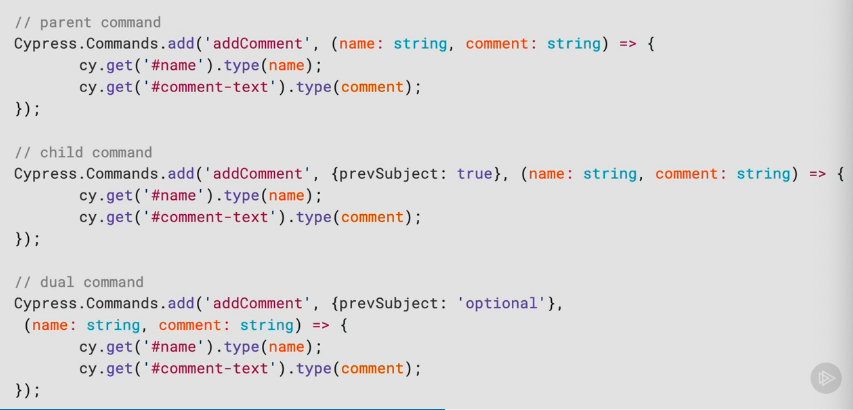
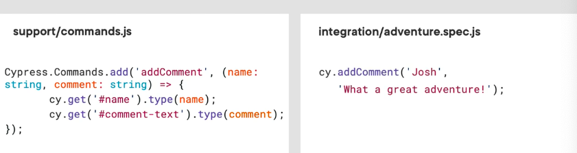
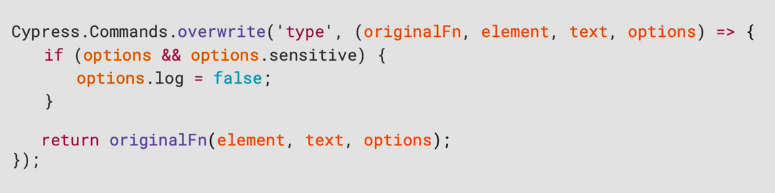
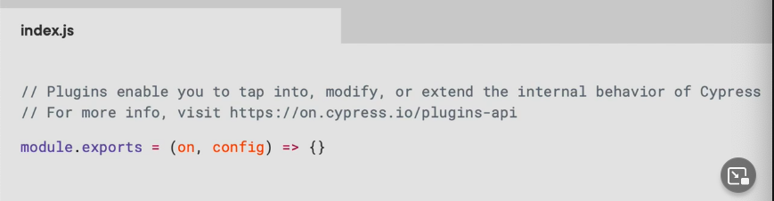
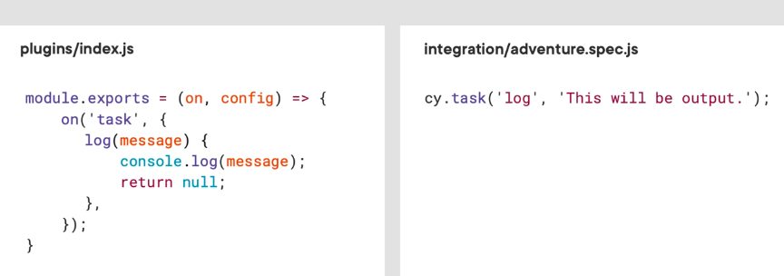
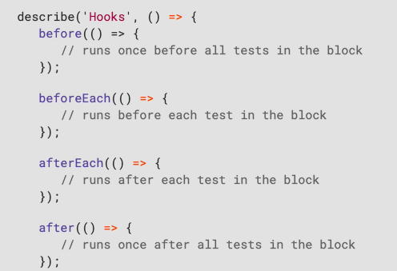

Todo: [Course link](https://app.pluralsight.com/library/courses/angular-end-to-end-testing-cypress/table-of-contents)

## Introducing Cypress

**What is Cypress?**

... (watch beginning again)

**End-to-end Testing** 

==> A type of testing in which business processes are tested from start to finish under production-like circumstances

**Login Example** (Canonical e2e testing example)

We have our login page, and all the stuff behind the scenes (3rd party id provider, auth middleware, etc), and e2e just verifies that "everything worked". That's contrasted to unit testing, which tests us what specifically worked.

UI testing = e2e testing

## Trade-offs

**Permanent**

- Not used to index web pages, perform performance testing, or to script 3rd part sites
- Communication with BE like server or DB is limited
- There is no multi-tab support
- Doesn't support multiple browsers open at the same time
- Tests are limited to the same origin

**Temporary**

- Workaround required for `cy.hover()` command - https://docs.cypress.io/api/commands/hover

See docs for more

## Demo

Use `data-cy` attributes in html specifically for Cypress tests

Commits?

### ... what happened to all your notes, Thomas? 

### Well, I played with `git stash` and `git stash pop` and got burned :fire: !!!

### ==> Don't use that again. Just paste in Readme right at the end. 

Will have to revisit parts of this course to get notes again.  

Get the stuff about **page object** and **app action** testing design patterns

Use module summaries for help

### Demo: Implementing Page Object Model

Commits: 0b7a768ee13bdccff4c7e7f5a9b9ebc871f7774a

## Testing Advanced Scenarios

- Commands and plugins, and how to define custom commands
- Making and intercepting HTTP requests 
- Understand lifecycle hooks and discover common use cases
- Using the Cypress CLI to run tests

### Commands and Plugins 

| Commands                               | Plugins                                                      |
| -------------------------------------- | ------------------------------------------------------------ |
| Functions that perform specifics tasks | Enable you to tap into, modify, or extend Cypress' internal behaviour |

**Commands**

`commands.js` .ts? ==> `index.js` 

**Types of commands:**

- Parent `visit()`, `.get()`
- Child `.click()`, `.type()`, `.should()`
- Dual `.contains()`

**Defining a custom command**

**Using a custom command**

**Overwriting a command**

**Plugins**

https://docs.cypress.io/plugins/directory

**When to use tasks?**

- Seeing a db
- Querying a db
- Override default Cypress' config

### Demo: Creating a custom command

Commit: 

## Making HTTP Requests

With Cypress, **CORS** checks are bypassed

**When do use requests**

- Log in (???)
- Getting data (???)
- Create data (for UI tests)

### Demo: Making HTTP Requests

### Demo: Using Hooks

In Cypress, it's suggested to do clean-ups **before** tests

... skipping final few parts of course. 

//todo: fix code (see commits)
